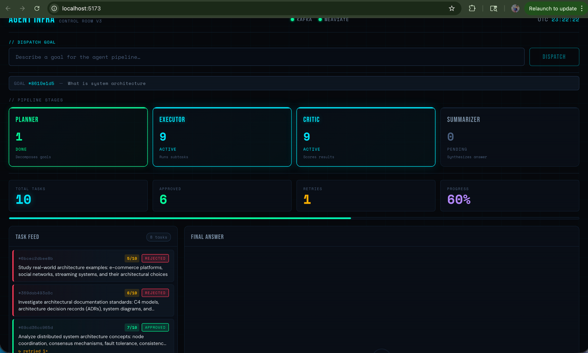
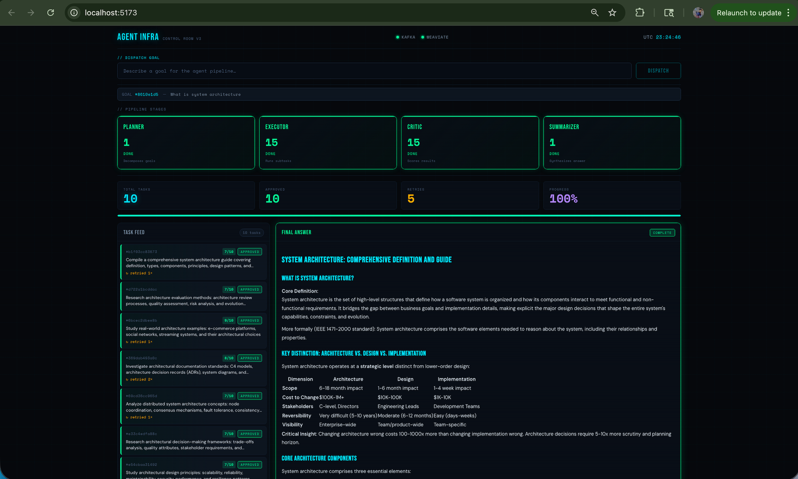

# Agent Infrastructure

> A production-grade distributed AI agent system — multi-agent goal decomposition, async Kafka messaging, semantic memory, LLM quality gating, and a real-time React dashboard.

[](https://github.com/NihalMishra17/agent-infra)
[](https://github.com/NihalMishra17/agent-infra)
[](https://github.com/NihalMishra17/agent-infra)
[](https://github.com/NihalMishra17/agent-infra)
[](https://github.com/NihalMishra17/agent-infra)
[](https://github.com/NihalMishra17/agent-infra)
[](https://github.com/NihalMishra17/agent-infra)

---

## What It Does

You type a high-level goal. Four specialized AI agents collaborate asynchronously over Kafka to research, evaluate, and synthesize a final answer — storing episodic memory in Weaviate so each agent gets smarter over time. The full pipeline is observable through a real-time React dashboard, queryable via a REST API, and controllable from Claude Desktop through an MCP server.

---

## Architecture

```
                         ┌─────────────────────────────────────────┐
                         │           Entry Points                  │
                         │                                         │
                    ┌────┴────┐   ┌─────────┐   ┌──────────────┐  │
                    │   CLI   │   │   UI    │   │  MCP Server  │  │
                    │ cli.py  │   │React/   │   │Claude Desktop│  │
                    └────┬────┘   │Vite     │   └──────┬───────┘  │
                         │        └────┬────┘          │          │
                         └────────────┼────────────────┘          │
                                      │                           │
                         POST /goals  │  GET /goals/:id/...       │
                                      ▼                           │
                              ┌───────────────┐                   │
                              │  FastAPI      │                   │
                              │  api.py :8000 │                   │
                              └───────┬───────┘                   │
                                      │                           │
                                      └───────────────────────────┘
                                      │
                              goals.submitted
                                      │
                                      ▼
                         ┌────────────────────────┐
                         │     Planner Agent      │  DSPy PlannerModule
                         │  Decomposes goal into  │  (ChainOfThought)
                         │  N parallel subtasks   │
                         └─────┬──────────────────┘
                               │                  │
                    tasks.assigned           goals.planned
                               │                  │
               ┌───────────────┘                  │
               ▼                                  │
  ┌────────────────────────┐                      │
  │    Executor Agent      │  DSPy ExecutorModule │
  │  Runs each subtask,    │◄── tasks.rejected ───┤
  │  retries on rejection  │    (with feedback)   │
  └────────────┬───────────┘                      │
               │                                  │
          tasks.completed                         │
               │                                  │
               ▼                                  │
  ┌────────────────────────┐                      │
  │     Critic Agent       │  DSPy CriticModule   │
  │  Scores result 1-10,   │  score ≥ 7 → approve │
  │  rejects with feedback │  score < 7 → reject  │
  └────────────┬───────────┘                      │
               │                                  │
          tasks.approved                          │
               │                                  │
               ▼                                  │
  ┌────────────────────────┐                      │
  │   Summarizer Agent     │  DSPy SummarizerModule
  │  Collects all approved │◄─────────────────────┘
  │  results, synthesizes  │  (waits for all N tasks
  │  final answer          │   or stale timeout)
  └────────────┬───────────┘
               │
         goals.summarized
               │
               ▼
  ┌────────────────────────────────────────┐
  │         Weaviate (Episodic Memory)     │
  │  Every agent stores entries here.      │
  │  Agents query past context before      │
  │  acting — memory hit rate grows        │
  │  with each goal.                       │
  └────────────────────────────────────────┘
               │
               ▼
         Final Answer
  (CLI output / UI panel / MCP tool)
```

---

## How It Works

### The Full Pipeline

1. **Goal submission** — a user submits a natural-language goal via the CLI, the React dashboard, or Claude Desktop (MCP). The goal is published to the `goals.submitted` Kafka topic.

2. **Planner** reads the goal, queries Weaviate for relevant past decompositions, then uses a DSPy `ChainOfThought` module to break the goal into N independently executable subtasks. Each subtask is published to `tasks.assigned`, and a `GoalPlan` message (with the expected task count) is published to `goals.planned` so the Summarizer knows when the goal is complete.

3. **Executor** picks up each task, searches Weaviate for any relevant past results (avoiding repeated work), executes it using a DSPy module backed by Claude, and publishes a `TaskResult` to `tasks.completed`. A second consumer loop handles `tasks.rejected` — if the Critic sends feedback, the Executor waits 5 seconds, appends the critique to its context, and retries. After 3 rejections a task is permanently skipped.

4. **Critic** reads each `TaskResult` and uses a DSPy `ChainOfThought` module to score the output 1–10 with reasoning and feedback. Results scoring ≥ 7 are forwarded to `tasks.approved`. Results scoring < 7 are published to `tasks.rejected` as `CriticFeedback` messages, triggering an Executor retry with the critique embedded in context.

5. **Summarizer** collects approved results as they arrive. Once all N tasks are approved (or 120 seconds pass after the last arrival, indicating a permanently skipped task), it uses a DSPy `SummarizerModule` to synthesize all results into a single coherent answer. The summary is published to `goals.summarized`, stored in Weaviate, and printed to the CLI / pushed to the UI.

### Episodic Memory

Every agent writes to the same Weaviate collection (`EpisodicMemory`) keyed by `goal_id` and `agent_id`. Before acting, agents run a semantic `near_text` search against past entries — so if a similar goal has been run before, the executor starts with relevant prior context. This is what causes the "memory hit rate" metric to grow over successive runs.

### Failure Handling

- **Rejected tasks**: Critic feedback is injected into the Executor's context on retry, so each attempt is informed by the previous failure.
- **Permanently skipped tasks**: After 3 rejections the Executor gives up silently. The Summarizer detects stall via a 120-second timeout and synthesizes with whatever approved results it has, logging a warning.
- **Infrastructure failures**: Weaviate connection errors on startup prevent agents from starting cleanly. Kafka topic creation is idempotent — topics are auto-created on agent startup.

---

## Tech Stack

| Technology | Role in this system |
|---|---|
| **Apache Kafka** | Async message bus connecting all agents; each topic is a typed event channel with 3 partitions for parallelism |
| **Weaviate** | Vector database for episodic memory; stores every agent's output and enables semantic retrieval via `text2vec-transformers` |
| **DSPy** | Prompt programming framework; each agent uses a `ChainOfThought` module with a typed signature — no hand-crafted prompt strings |
| **Anthropic Claude** | LLM powering all four DSPy modules; currently `claude-haiku-4-5` via the Anthropic API |
| **FastAPI** | REST API over the pipeline — submits goals, exposes status/task/summary endpoints, reconstructs task state from Weaviate |
| **React 18 + Vite** | Real-time dashboard; polls the FastAPI server every 3s, renders pipeline stage health, task feed, animated metrics, and markdown final answer |
| **MCP (Model Context Protocol)** | Exposes the pipeline as callable tools in Claude Desktop — `submit_goal`, `get_goal_status`, `search_memory`, `get_final_summary` |
| **Docker Compose** | Runs Kafka, Zookeeper, Weaviate, the `text2vec-transformers` inference server, and Kafka UI locally |
| **Poetry** | Python dependency management and virtualenv isolation |

---

## Project Structure

```
agent-infra/
│
├── agents/
│   ├── planner/agent.py       # Decomposes goals into subtasks via DSPy; publishes GoalPlan
│   ├── executor/agent.py      # Executes tasks; retries with critic feedback (max 3×)
│   ├── critic/agent.py        # Scores TaskResults 1-10; routes to approved or rejected
│   └── summarizer/agent.py    # Waits for all approvals; synthesizes final answer
│
├── core/
│   ├── models.py              # Pydantic models: Goal, Task, TaskResult, CriticFeedback, GoalPlan, FinalSummary
│   ├── kafka.py               # KafkaPublisher, KafkaConsumerLoop, topic helpers
│   ├── memory.py              # Weaviate MemoryClient: store, search, count, fetch
│   └── dspy_modules.py        # DSPy signatures and modules for all four agents
│
├── mcp_server/
│   └── server.py              # stdio MCP server exposing 4 tools to Claude Desktop
│
├── config/
│   └── topics.py              # Kafka topic enum and ALL_TOPICS list
│
├── ui/                        # React 18 + Vite dashboard
│   ├── src/
│   │   ├── App.jsx            # Root component; manages all polling state
│   │   ├── index.css          # Full design system: dark theme, animations, layout
│   │   └── components/
│   │       ├── Header.jsx     # Brand, health dots (Kafka/Weaviate), live UTC clock
│   │       ├── GoalInput.jsx  # Goal submission bar with dispatch button
│   │       ├── PipelineStages.jsx  # 4 stage cards: pending/active/done states
│   │       ├── MetricsRow.jsx      # Animated count-up metrics + progress bar
│   │       ├── TaskFeed.jsx        # Scrollable task cards with status + critic scores
│   │       ├── FinalAnswer.jsx     # Markdown-rendered final answer panel
│   │       └── MemorySearch.jsx    # Semantic memory search with agent filter
│   ├── index.html
│   ├── vite.config.js         # Dev server proxy → localhost:8000
│   └── package.json
│
├── api.py                     # FastAPI server: health, goal submission, status, tasks, summary, memory search
├── cli.py                     # Terminal client: submit goal, stream task results, print final answer
├── docker-compose.yml         # Kafka + Zookeeper + Weaviate + t2v-transformers + Kafka UI
├── pyproject.toml             # Python dependencies (Poetry)
└── .env                       # API keys and service URLs (not committed)
```

---

## Prerequisites

| Requirement | Version | Notes |
|---|---|---|
| **Docker Desktop** | Latest | Must be running before `docker compose up` |
| **Python** | 3.12 | Managed via `conda` or `pyenv` |
| **Poetry** | Latest | `curl -sSL https://install.python-poetry.org \| python3 -` |
| **Node.js** | 18+ | For the React dashboard |
| **Anthropic API key** | — | [console.anthropic.com](https://console.anthropic.com) |

---

## Setup & Run

### 1. Clone and install Python dependencies

```bash
git clone https://github.com/NihalMishra17/agent-infra
cd agent-infra
poetry install
```

### 2. Configure environment

```bash
cp .env.example .env
```

Edit `.env` and set your Anthropic API key:

```
ANTHROPIC_API_KEY=sk-ant-...
KAFKA_BOOTSTRAP_SERVERS=localhost:9092
WEAVIATE_HOST=localhost
WEAVIATE_PORT=8080
DSPY_MODEL=claude-haiku-4-5
DSPY_MAX_TOKENS=2048
PLANNER_CONSUMER_GROUP=planner-group
EXECUTOR_CONSUMER_GROUP=executor-group
```

### 3. Start infrastructure

```bash
docker compose up -d
```

Wait ~15 seconds for Weaviate and the transformer inference server to be ready.

| Service | URL |
|---|---|
| Kafka broker | `localhost:9092` |
| Kafka UI | http://localhost:8090 |
| Weaviate | http://localhost:8080 |
| t2v-transformers | http://localhost:8081 |

### 4. Activate the virtualenv

```bash
# If using poetry shell:
poetry shell

# Or activate directly:
source $(poetry env info --path)/bin/activate
```

### 5. Run the four agents (one terminal each)

```bash
# Terminal 1 — Planner
python -m agents.planner.agent

# Terminal 2 — Executor
python -m agents.executor.agent

# Terminal 3 — Critic
python -m agents.critic.agent

# Terminal 4 — Summarizer
python -m agents.summarizer.agent
```

### 6. Start the API server

```bash
# Terminal 5
uvicorn api:app --reload --port 8000
```

### 7. Start the React dashboard

```bash
# Terminal 6
cd ui
npm install   # first time only
npm run dev
```

Open **http://localhost:5173**

### 8. Submit a goal (CLI or dashboard)

**CLI:**
```bash
python cli.py "Explain the key differences between transformer and diffusion model architectures"
```

**Dashboard:** type the goal into the input bar and click **DISPATCH**.

**Claude Desktop (MCP):** see the [MCP section](#mcp-server--claude-desktop) below.

---

## Kafka Topics

| Topic | Published by | Consumed by | Purpose |
|---|---|---|---|
| `goals.submitted` | CLI · UI · MCP | Planner | New user goals enter the pipeline here |
| `goals.planned` | Planner | Summarizer | Carries expected task count so Summarizer knows when a goal is complete |
| `goals.summarized` | Summarizer | CLI · UI | Final synthesized answer |
| `tasks.assigned` | Planner | Executor | Individual subtasks to be executed |
| `tasks.completed` | Executor | Critic | Raw task output awaiting quality evaluation |
| `tasks.rejected` | Critic | Executor | Failed output with feedback for retry |
| `tasks.approved` | Critic | Summarizer | Quality-gated results ready for synthesis |

---

## API Endpoints

| Method | Path | Description |
|---|---|---|
| `GET` | `/health` | Returns `{ kafka: bool, weaviate: bool }` — used by the UI health dots |
| `POST` | `/goals` | Body: `{ description }` — publishes to Kafka, returns `goal_id` |
| `GET` | `/goals/{id}/status` | Pipeline stage progress, task count, approval count, progress % |
| `GET` | `/goals/{id}/tasks` | Task cards reconstructed from Weaviate memory (description, status, score, feedback) |
| `GET` | `/goals/{id}/summary` | Final synthesized answer once the Summarizer has completed |
| `GET` | `/memory/search` | Query params: `q`, `agent_id` (optional), `limit` — semantic search over Weaviate |

Interactive docs available at **http://localhost:8000/docs** when the API server is running.

---

## MCP Server & Claude Desktop

The MCP server exposes the pipeline as tools directly in Claude Desktop.

**Run the server:**
```bash
python -m mcp_server.server
```

**Connect to Claude Desktop** — add to `~/Library/Application Support/Claude/claude_desktop_config.json`:

```json
{
  "mcpServers": {
    "agent-infra": {
      "command": "/path/to/your/virtualenv/bin/python",
      "args": ["-m", "mcp_server.server"],
      "cwd": "/path/to/agent-infra",
      "env": {
        "ANTHROPIC_API_KEY": "<your-key>",
        "KAFKA_BOOTSTRAP_SERVERS": "localhost:9092",
        "WEAVIATE_HOST": "localhost",
        "WEAVIATE_PORT": "8080"
      }
    }
  }
}
```

Restart Claude Desktop. Four tools will appear in the tool panel:

| Tool | Description |
|---|---|
| `submit_goal` | Publish a goal to the pipeline; returns `goal_id` |
| `get_goal_status` | Check pipeline stage progress and memory entry counts |
| `search_memory` | Semantic search over all episodic memory |
| `get_final_summary` | Retrieve the synthesized answer for a completed goal |

---

## Demo

**Pipeline in progress** — Executor and Critic active, 6/10 tasks approved, critic rejection/retry loop visible in the task feed:



**Completed run** — all four stages green, 10/10 approved, final answer synthesized and rendered as markdown:



---

## Resume Metrics to Track

Run experiments and record these numbers — they make strong talking points:

| Metric | How to measure | Target |
|---|---|---|
| **Executor throughput** | Tasks completed per minute across N executor instances | Baseline single-instance, then 2× |
| **End-to-end latency** | `goals.submitted` timestamp → `goals.summarized` timestamp | Track as goal complexity increases |
| **Critic approval rate** | `approved / (approved + rejected)` per run | Indicates prompt quality |
| **Retry rate** | Total retries / total tasks | Lower = better first-attempt quality |
| **Memory hit rate** | % of tasks where `past_context` was non-empty | Should increase over successive similar goals |
| **Stale synthesizer triggers** | How often the 120s timeout fires vs. normal completion | Proxy for permanent failure rate |

---

## What's Next

- **Phase 4 — DSPy optimization loop**: compile DSPy modules with `dspy.BootstrapFewShot` using critic scores as the reward signal, improving prompt quality automatically over runs
- **AKS deployment**: Kubernetes manifests for each agent as a separate `Deployment`, Kafka and Weaviate as `StatefulSet`s, HPA on the Executor based on `tasks.assigned` consumer lag
- **Streaming results**: replace polling with Server-Sent Events on the API server for lower-latency dashboard updates
- **Multi-executor parallelism**: benchmark throughput with 2, 4, 8 concurrent executor instances consuming from the same consumer group
